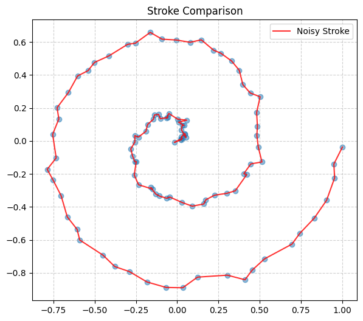
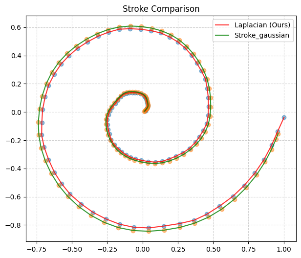
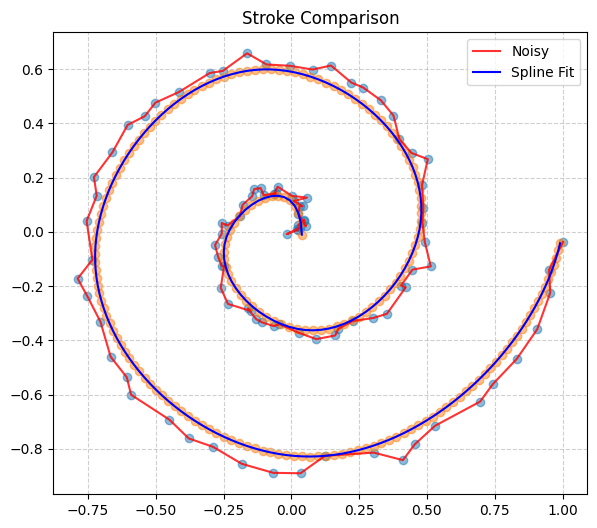
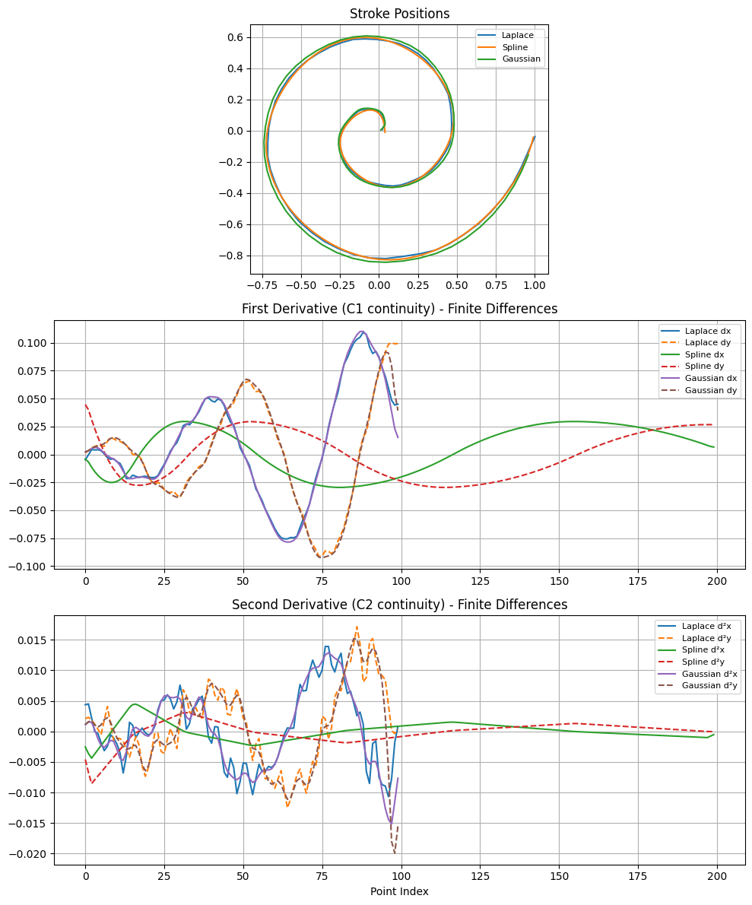

# Parametric Curve Smoothing and Continuity Analysis

## Project Description

This project explores methods for smoothing noisy 2D parametric curves, focusing on preserving continuity properties. We compare a custom Discrete Laplacian smoothing method with standard techniques like Gaussian filtering, and demonstrate the advantages of Cubic Spline fitting for ensuring C2 continuity.

## Mathematical Background

The full mathematical formulation, derivations, and theoretical justification for the methods used in this project are provided in  
[mathematical_background](./mathematical_background)

## Project Steps

### 1. Noisy Stroke Generation
We begin by generating synthetic ground truth parametric curves (e.g., sine, spiral, circle) and then corrupt them with Gaussian noise to simulate real-world sensor jitter or measurement inaccuracies. This provides a baseline for evaluating smoothing algorithms.



*A spiral curve corrupted with Gaussian noise.*

### 2. Laplace and Standard Gaussian Comparison
We implement and compare the Discrete Laplacian (Variational) smoothing method against a standard Gaussian filter. The Discrete Laplacian method aims to minimize a cost function that balances fidelity to the original data with curve smoothness.



*Comparison of Laplacian vs. Gaussian smoothing on a noisy stroke.*

### 3. Spline Fitting
To achieve higher levels of continuity and enable stable derivative computations, we fit the smoothed curves using Cubic Splines. This parametric approach allows for robust representation of complex shapes, including loops and self-intersections, and offers precise control over smoothness through a dedicated parameter.



*A noisy stroke smoothed and represented by a cubic spline.*

### 4. Continuity Graphs
Finally, we analyze the continuity of the smoothed curves by visualizing their first (velocity) and second (acceleration) derivatives. This step highlights how different smoothing techniques impact the C1 and C2 continuity of the curve, demonstrating the benefits of methods like cubic splines for producing physically plausible and smooth trajectories.



*Graphs showing C1 and C2 continuity for different smoothing methods.*

## Setup and Usage

To run this project:

1. Ensure you have the necessary Python libraries installed:
   ```bash
   pip install numpy matplotlib scipy
   ```
2. Open the Jupyter/Colab [notebook](/notebook/Stroke_Smoothing.ipynb).
3. Run all cells sequentially to generate the data, apply smoothing, fit splines, and visualize the results.
